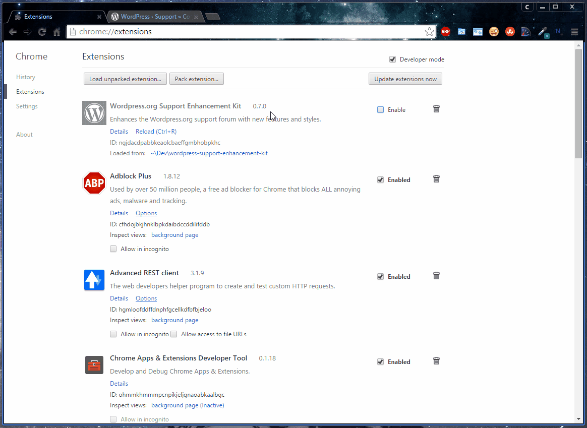

# Wordpress.org Support Enhancement Kit

A Chrome extension that overrides the default Wordpress.org support forum styles and adds pizazz to the page(s).

  - Overrides topic page post styling.
  - Adds TinyMCE to the thread comment box.

### Install
Download the extension on the [Chrome Web Store](https://chrome.google.com/webstore/detail/wordpressorg-support-enha/mlodkondjlhhbhcokbpgiafemehdcbel?utm_source=plus) to install.

### Roadmap

As new features and styles are added, let's attempt to keep things conditional by utilizing an options page. This project will be bumped to 0.9.0 once an options page is in effect. Some features that would be nice to see are:

- [ ] Option: Choose between TinyMCE, CKEditor, or [?].
- [ ] Color schemes.
- [ ] Link previews on hover.

### License

MIT
